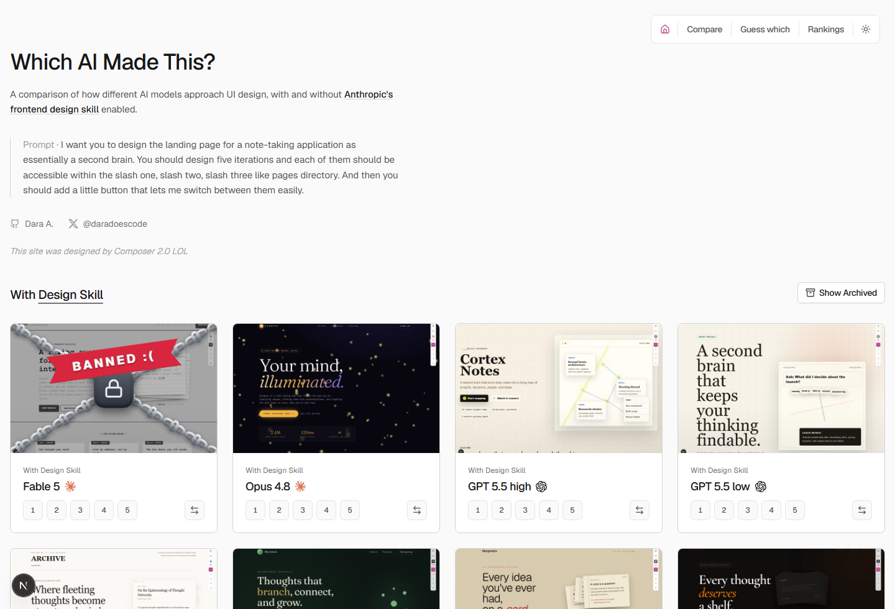
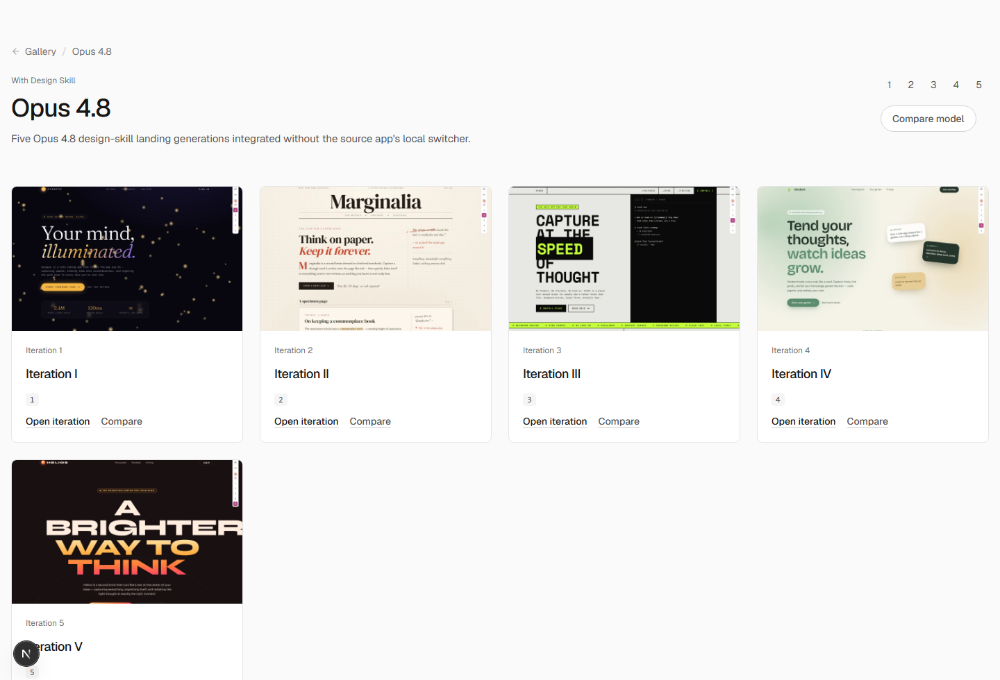
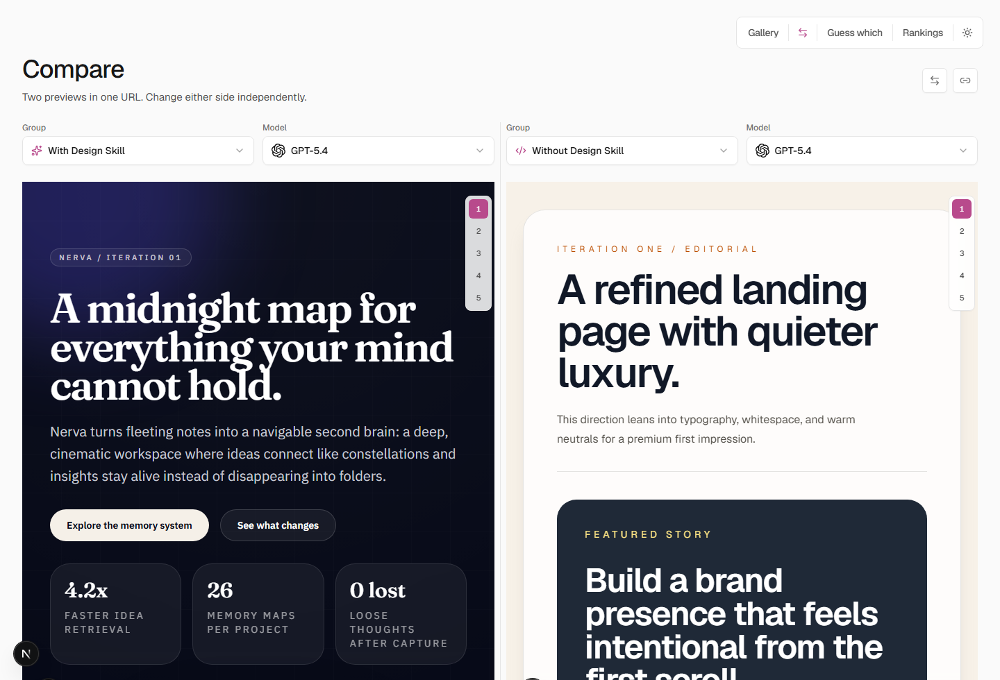
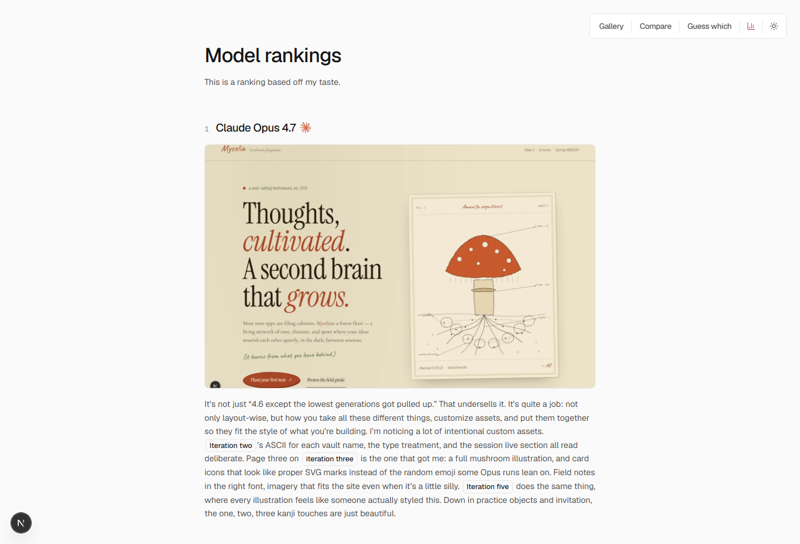
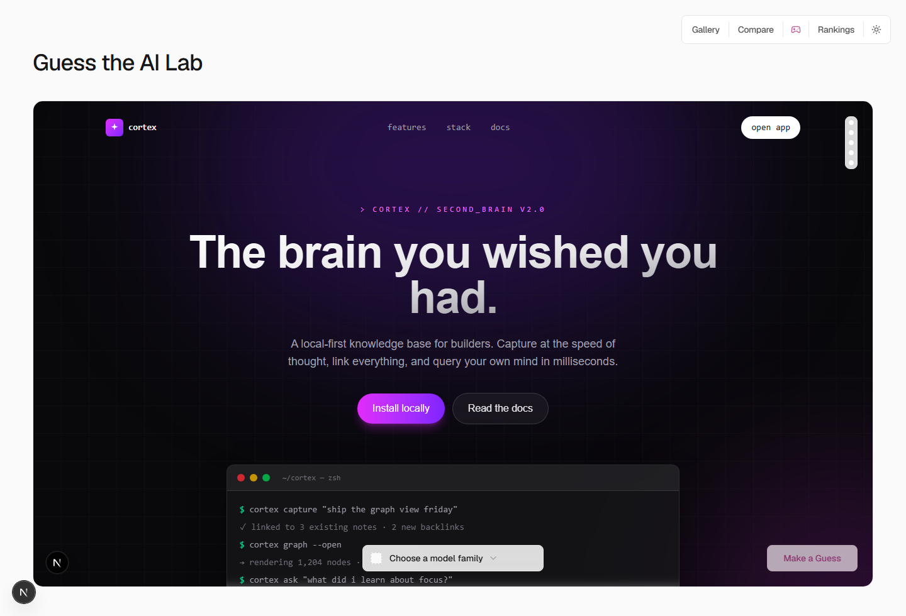

# WhichAI.dev

**A side-by-side look at which AI models can actually design.**

Every few days someone drops a new leaderboard proving that Model A is 2.3% better than Model B at reasoning, coding, or being polite. Which is fine, but none of those spreadsheets tell you what you actually want to know: *if I ask this thing to build a landing page, will it look good?*

We asked a growing list of AI models to design five landing-page concepts for a second-brain note-taking app. Same prompt. Same brief. Multiple attempts preserved. Then we laid out the results so you can see the differences with your own eyes, no benchmark literacy required.

## What You'll Find

**A gallery, not a spreadsheet.**
The home page groups model runs by condition: baseline, design-skill-enabled, taste experiments, and everything in between. Each card shows five real rendered previews. These are actual generated pages, not slides from a press kit.

**Compare anything.**
Pick any two runs and look at them together in a single shareable URL. Baseline vs. design skill. Model X vs. Model Y. Iteration 1 vs. iteration 5. It is a fast way to turn "vibes say this one is better" into "okay, yeah, that one is better."

**Rankings with actual notes.**
The rankings page is subjective, because design is subjective. We call out what worked, what felt like a template, and where a model showed real taste instead of just following instructions.

**Lab Guess.**
Look at a generation, guess the model, see if you are right. It is surprisingly educational. You start noticing tics: the models that turn every page into a card grid, the ones that love oversized typography, the ones that quietly know how to use whitespace.

## Why It Exists

Model selection is a design decision. Some models give you solid structure and weak taste. Some produce one gorgeous screen and ignore the rest of the brief. Some completely change character when you toggle a design skill.

WhichAI.dev makes those differences obvious. It is for builders choosing a tool, researchers who want a corpus they can read without a CLI, and anyone who heard AI can build apps and wants a visual answer to "okay, but is it any good at design?"
